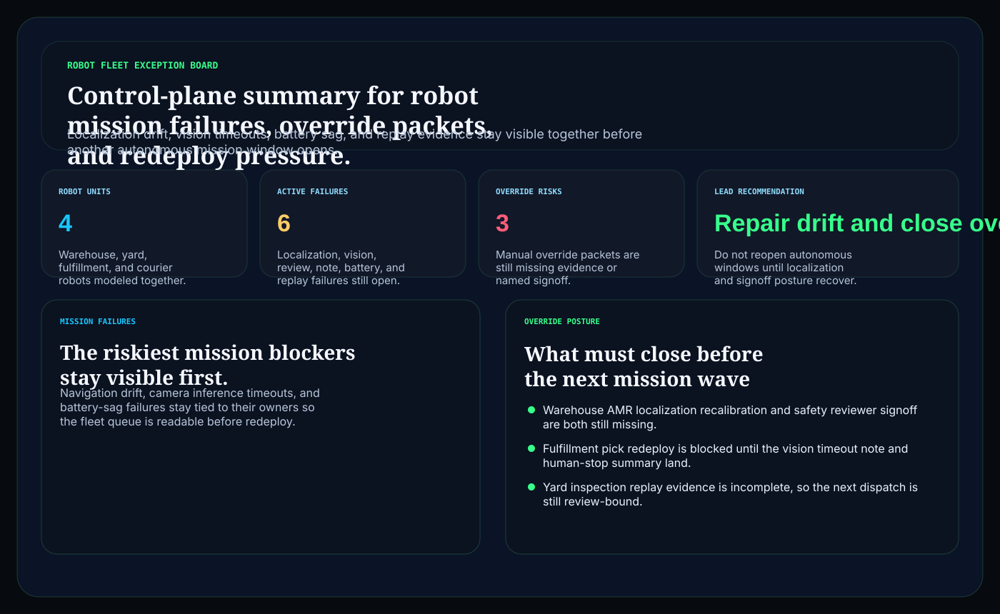
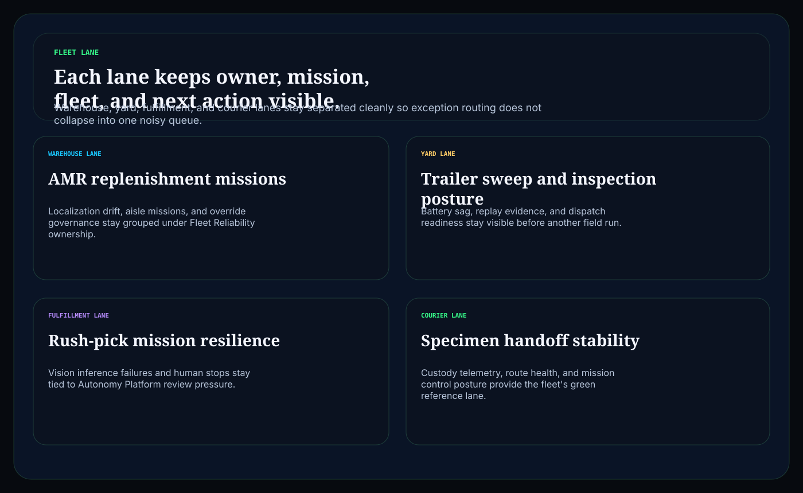
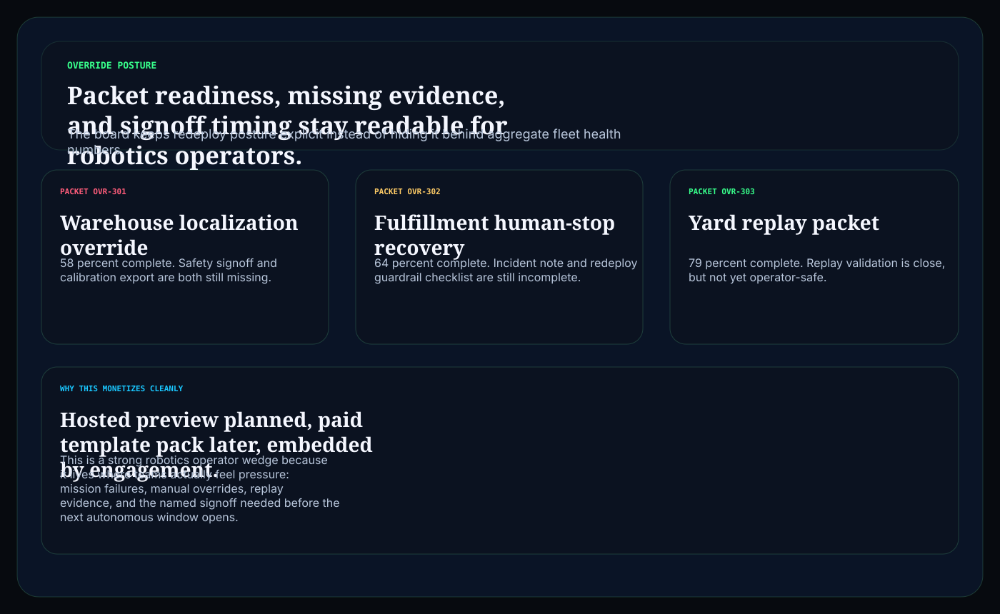

# robot-fleet-exception-board

C# / ASP.NET operator surface for robot fleet failures, human override packets, redeploy posture, and mission-safe review routing.

## Why this matters

Robotics teams do not need another uptime dashboard that says the fleet is green while localization drift, camera timeouts, override packets, and operator notes are still unresolved. They need one board that keeps mission pressure, incident evidence, and redeploy readiness visible together before the next autonomous window opens.

This repo is the public proof surface for that pattern:

- `Hosted preview planned` for a browser-based fleet exception board
- `Embedded by engagement` for teams that need the routing model inside autonomy, fleet, or safety workflows

## What it includes

- ASP.NET Core minimal API in C#
- synthetic robot fleet missions, failures, and override packets
- operator surfaces for:
  - `/fleet-lane`
  - `/mission-failures`
  - `/override-posture`
  - `/verification`
  - `/docs`
- structured JSON endpoints under `/api/*`
- static Pages export with `robots.txt`, `sitemap.xml`, and `CNAME`

## Screenshots





## Verification

- synthetic robotics mission and override evidence only
- no live robot, facility, patient, inventory, or industrial control data
- no claim of ISO 10218, IEC 61508, SOC 2, or safety certification
- this is a control-plane proof surface for robotics workflow depth, not a certification claim

## Local run

```powershell
dotnet test
dotnet run --project src/RobotFleetExceptionBoard.Api -- --demo
dotnet run --project src/RobotFleetExceptionBoard.Api
```

Then open:

- `http://127.0.0.1:5090/`
- `http://127.0.0.1:5090/fleet-lane`
- `http://127.0.0.1:5090/mission-failures`
- `http://127.0.0.1:5090/override-posture`

## Render static site

```powershell
dotnet run --project src/RobotFleetExceptionBoard.Api -- --prerender
```

## Related docs

- [Embedded framing](./docs/KINETIC_GAIN_EMBEDDED.md)
- [Origin story](./docs/ORIGIN.md)
